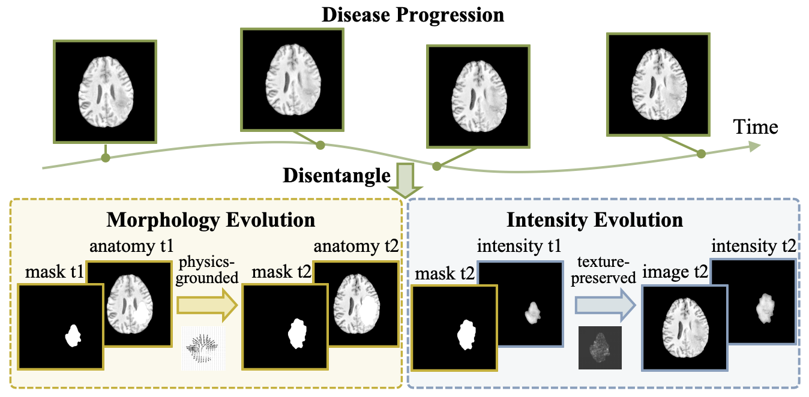

<h1 align="center">
 [ECCV 2026 Accepted] PDF
</h1>

<p align="center">
<strong>Physics-Grounded Disentangled Flow Modeling for Brain Disease Progression Trajectory</strong>
<br>
<strong></strong>
<!-- <br> -->
<!-- <strong>Accepted to ECCV 2026</strong> -->
</p>

<p align="center">

</p>

This is the official code release for **PDF**, accepted to **ECCV 2026**. PDF is a framework for modeling longitudinal lesion evolution in medical images. The method separates disease progression into two stages:

1. **Morphology stage**: predicts lesion mask evolution with a PDE-regularized flow and warps the source image accordingly.
2. **Intensity stage**: edits texture and intensity after the morph stage to better match follow-up appearance.


## Method Overview

PDF is designed for paired or longitudinal medical images with lesion masks. Given an initial image and lesion mask, the morph model estimates lesion shape progression over a time interval. The predicted mask evolution is used to produce a spatial warp. Then the intensity model refines local appearance inside the predicted lesion region.


## Repository Hierarchy

```text
PDF
├── README.md
├── requirements.tx
├── LICENSE.md
└── src
    ├── train_pdf.py          # unified training entry point
    ├── test_pdf.py           # core PDF inference/test entry point
    ├── pdf_stages            # internal morph and intensity implementations
    ├── nn                    # PDF model API, definitions, and backbones
    ├── datasets              # longitudinal brain dataset loaders
    ├── data_utils            # dataset preparation and split helpers
    └── utils                 # logging, metrics, parsing, and seed helpers
```

The public entry points are `src/train_pdf.py` and `src/test_pdf.py`. The files under `src/pdf_stages/` are implementation modules used by `train_pdf.py`.

## Installation

Create a conda environment named `PDF`, then install the dependencies:

```bash
conda create -n PDF python=3.10 -y
conda activate PDF
cd /path/to/PDF
pip install -r requirements.txt
```

Install PyTorch for your CUDA environment first if your local setup requires a specific PyTorch/CUDA build. The lightweight requirements file includes the remaining Python packages used by the released code.

## Data

By default, dataset loaders expect local data under ignored `data/` folders. The public datasets need to be downloaded from their source pages and preprocessed into the folder structure expected by the loaders.

The code keeps brain longitudinal dataset loaders for:

```text
brain_ucsf_growth     UCSF brain lesion progression
brain_lumiere_growth  LUMIERE lesion progression
brain_ms_growth       Multiple sclerosis lesion progression
```

Download/source links:

- `brain_ucsf_growth`: UCSF brain metastases MRI dataset: https://imagingdatasets.ucsf.edu/dataset/1
- `brain_lumiere_growth`: LUMIERE longitudinal MRI dataset: https://doi.org/10.6084/m9.figshare.c.5904905.v1
- `brain_ms_growth`: 2015 Longitudinal MS Lesion Segmentation Challenge: https://iacl.ece.jhu.edu/index.php?title=MSChallenge/data; challenge portal: https://smart-stats-tools.org/lesion-challenge

After downloading, place the processed data under `data/` using the folder names referenced in `src/data_utils/prepare_dataset.py`. The dataset preparation logic lives in `src/data_utils/prepare_dataset.py`. The dataset loaders live in `src/datasets/`.

## Training

Use `train_pdf.py` as the only public training entry point. Select the training stage with `--stage`.

### Train the morph stage

```bash
cd src
python train_pdf.py \
  --stage morph \
  --mode train \
  --dataset-name brain_ucsf_growth \
  --model PDF_morph
```

### Train the intensity stage

```bash
cd src
python train_pdf.py \
  --stage intensity \
  --mode train \
  --dataset-name brain_ucsf_growth \
  --model PDF_intensity
```

All arguments after `--stage` are forwarded to the selected stage implementation.

Common arguments:

```text
--dataset-name              dataset key, for example brain_ucsf_growth
--target-dim                image size, default (256, 256)
--output-save-folder        output folder for logs and checkpoints
--segmentor-ckpt            segmentor checkpoint for metrics
--num-filters               base UNet width
--depth                     UNet depth
--batch-size                training batch size
--max-epochs                number of training epochs
--train-val-test-ratio      patient-level split ratio
```

## Inference And Testing

Use `test_pdf.py` for dataset-level evaluation. By default, it evaluates the configured test split and writes `metrics.csv` under the output folder. The morph checkpoint is passed with `--model-ckpt`; the intensity checkpoint is optional and enables the intensity editing stage.

```bash
cd src
python test_pdf.py \
  --dataset-name brain_ucsf_growth \
  --model-ckpt /path/to/morph_model.pty \
  --intensity-model-ckpt /path/to/intensity_model.pty \
  --segmentor-ckpt /path/to/segmentor.pty \
  --output-folder ./results_test
```

For qualitative inspection of a specific image pair, use pair mode.

```bash
cd src
python test_pdf.py \
  --eval-mode pair \
  --dataset-name brain_ucsf_growth \
  --t1-path /path/to/time_01.png \
  --t2-path /path/to/time_02.png \
  --m1-path /path/to/time_01_mask.png \
  --m2-path /path/to/time_02_mask.png \
  --model-ckpt /path/to/morph_model.pty \
  --intensity-model-ckpt /path/to/intensity_model.pty \
  --segmentor-ckpt /path/to/segmentor.pty \
  --output-folder ./results_inference
```

Input image names in pair mode should contain a time token compatible with the parser in `test_pdf.py`, for example `time_01.png` and `time_02.png`.

## Reproducing Experiments

A typical workflow is:

1. Prepare local images and masks in the expected dataset folders.
2. Train the morph stage with `train_pdf.py --stage morph`.
3. Train the optional intensity stage with `train_pdf.py --stage intensity`.
4. Run dataset-level evaluation with `test_pdf.py`.

Generated outputs, logs, checkpoints, and figures should stay outside git-tracked files. The repository `.gitignore` is set up for that workflow.

## What Is Excluded

The public package deliberately excludes:

- private medical data
- generated `results/` and `result/` folders
- checkpoints and model weights
- notebooks and notebook outputs
- non-PDF baselines
- visualization-only test scripts
- cached Python files
- binary arrays and generated images

## Citation

If you use this code, please cite the associated PDF paper when available.

```bibtex
@article{wang2026physics,
  title={Physics-Grounded Disentangled Flow Modeling for Brain Disease Progression Trajectory},
  author={Wang, Jun and Liu, Peirong},
  journal={arXiv preprint arXiv:2606.28630},
  year={2026}
}
```

## License

See `LICENSE.md`.
<!-- # PDF -->
